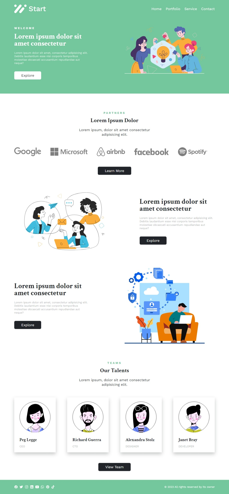

# Small Startup Website

Small startup website is a fictional website of a small startup company. This website created for practising my front-end skill. This website was originally design by freecodecamp youtube channel.

## Table of Contents

-  [Technology I used](#technology-i-used)
-  [What I have learned](#what-i-have-learned)
-  [How to run](#how-to-run)
-  [screenshot](#sreenshot)
-  [Link](#link)
-  [Credit](#credit)

## Technology I used

-  HTML
-  CSS flexbox
-  CSS Grid
-  SASS (CSS preproccer)
-  Vanilla Javascript
-  NPM for development purpose

## What I have learned

-  How to think in css grid way to make different type of layout
-  How to work CSS grid along CSS flexbox
-  How to work with sass
-  7-1 architecture for SASS
-  How to create reponsive manager using SASS mixins
-  How to use autoprefixer to add browser prefix
-  How to create efficient CSS development environment using NPM script
-  How to build efficent CSS file using NPM Script

## How to run

Please follow the below instructions to run this project in your machine:

1. Clone this repository

   ```sh
   git clone https://github.com/sagormajomder/small-startup.git
   ```

2. To run below command, your machine must have install nodejs
3. Open terminal and run
   ```sh
       npm install
   ```
4. For development run
   ```sh
       npm start
   ```
5. For production build, run
   ```sh
       npm run build:css
   ```

## Sreenshot



## link

GitHub Repository Link: [https://github.com/sagormajomder/small-startup.git](https://github.com/sagormajomder/small-startup.git)

Website Live Link: [https://sagormajomder.github.io/small-startup](https://sagormajomder.github.io/small-startup)

Figma Design Link: [https://www.figma.com/community/file/1150370769219258177](https://www.figma.com/community/file/1150370769219258177)

## Credit

Website is originally design by [freeCodeCamp Bengali](https://www.youtube.com/@freecodecampbengali) Youtube channel
